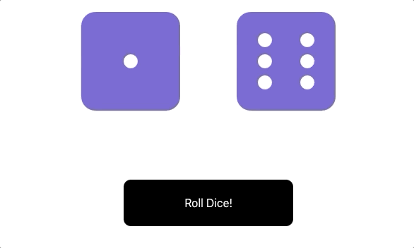

# Dice Rolls

This exercise practices working with props, defaultProps, state, and simple click events in React.

## Roll Dice

## Component Structure

- `RollDice.js`: a parent component (rendered by App) that renders the dice and a button to roll.
- `Die.js`: an individual die that takes props and displays the correct face of the die based on props.
